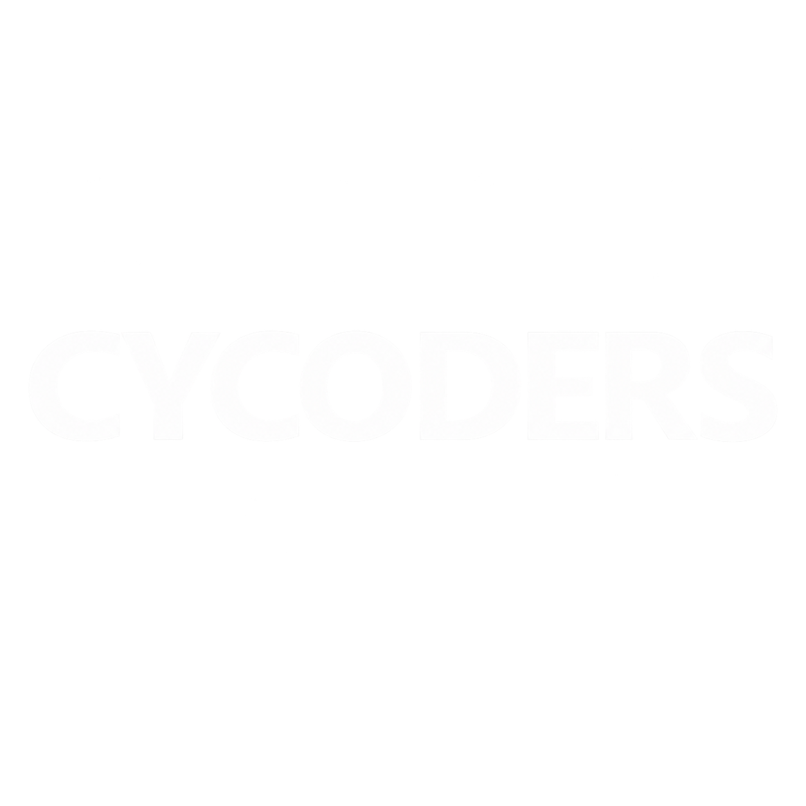
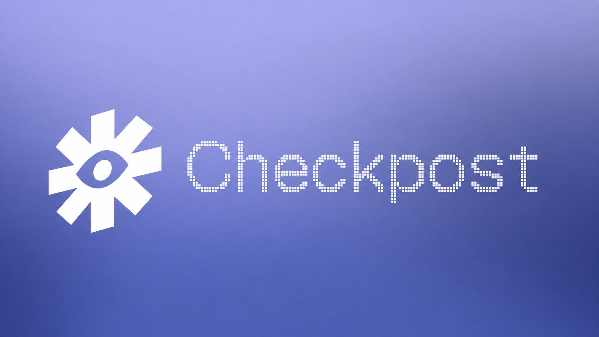
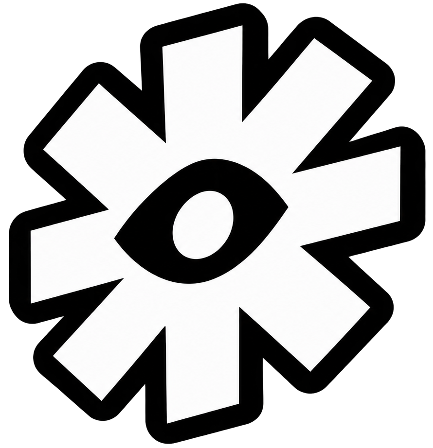
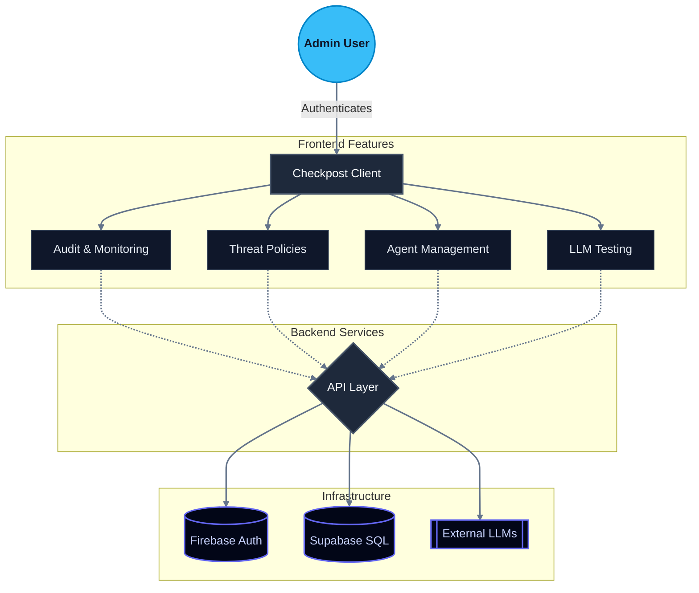
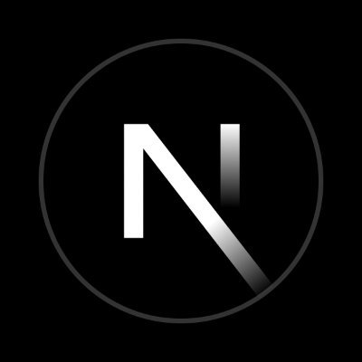
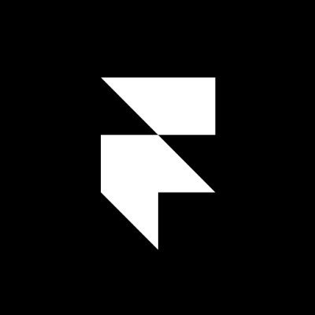
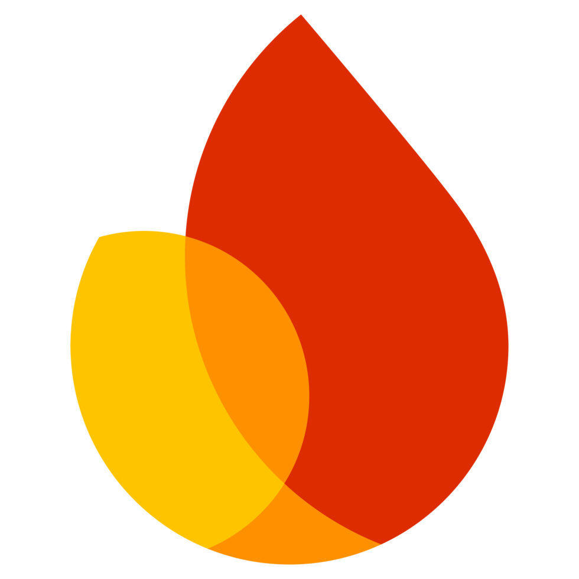
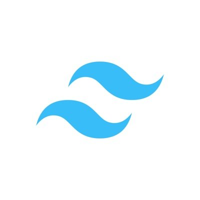
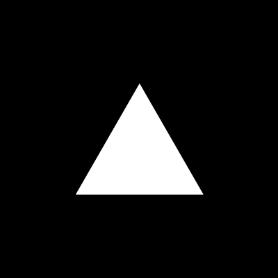

  
  
  

   
   

  
  
   
   

  <h1> Checkpost</h1>
  
  
<strong>A modern, enterprise-grade AI security and monitoring dashboard.</strong>

**Checkpost** (repository: `vibeforge`) provides a comprehensive suite of tools for managing AI agents, testing Large Language Models (LLMs), and enforcing robust security policies—all wrapped in a stunning, highly responsive user interface.

##  Architecture

Below is a high-level overview of the Checkpost architecture and user flow:

##  Features

| Feature | Description |
| :--- | :--- |
| ** Comprehensive Monitoring** | Keep track of system health with a real-time dashboard and detailed audit logs. |
| ** Asset Management** | Seamlessly orchestrate your AI agents and perform isolated tests on various LLMs directly from the platform. |
| ** Advanced Security** | Define strict usage policies and monitor potential threats to ensure safe and compliant AI deployments. |
| ** Premium UI/UX** | Built with Framer Motion, Tailwind CSS 4, and Lucide Icons for a beautiful, dynamic, and glassmorphism-inspired aesthetic. |
| ** Secure Authentication** | Integrated with Firebase for secure, frictionless user authentication and session management. |

##  Tech Stack

| Technology | Logo | Technology | Logo |
| :--- | :--- | :--- | :--- |
| **Next.js** |  | **Framer Motion** |  |
| **TypeScript** |  | **Firebase** |  |
| **React** |  | **Supabase** |  |
| **Tailwind CSS** |  | **Vercel** |  |

##  Project Structure

- `/src/app` - Next.js app router pages and layouts (Dashboard, Authentication, etc.)
- `/src/components` - Reusable React components (UI elements, Layouts)
- `/src/context` - React Context providers (AuthContext, DatabaseContext)
- `/src/lib` - Utility functions and third-party initializations (Firebase)

##  Team

| Photo | Name | Role |
| :---: | :--- | :--- |
|  | **Souradeep Pradhan** | Full Stack Developer |
|  | **Aniruddha Das** | Full Stack Developer |
|  | **Sattwik Das** | Full Stack Developer |

---

##  License

This project is licensed under the terms found in the [LICENSE](./LICENSE) file (Apache-2.0).

---

Made with ❤️ for devs by devs — <b>Fantastic 4</b>

