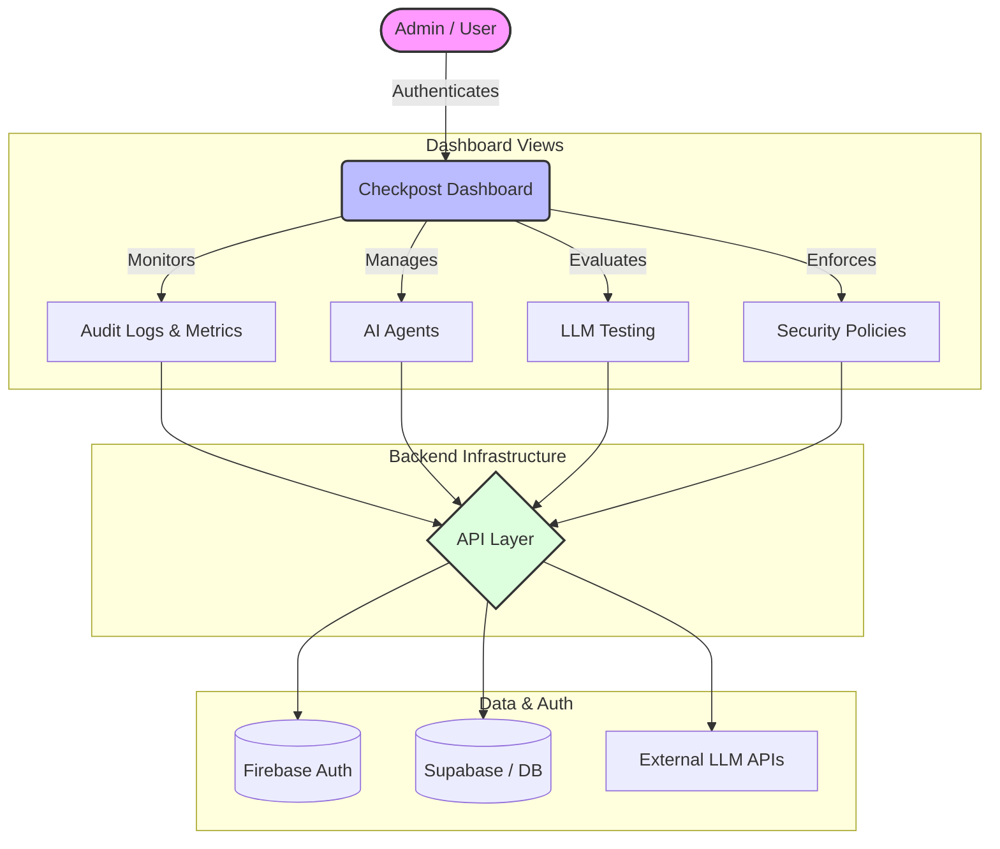

<div align="center">
  
  <br />
  

  <h1> Checkpost</h1>
  
  <p><strong>A modern, enterprise-grade AI security and monitoring dashboard.</strong></p>

  <p>
    <a href="https://nextjs.org/"></a>
    <a href="https://react.dev/"></a>
    <a href="https://tailwindcss.com/"></a>
    <a href="https://firebase.google.com/"></a>
    <a href="https://supabase.com/"></a>
  </p>
</div>

**Checkpost** (repository: `vibeforge`) provides a comprehensive suite of tools for managing AI agents, testing Large Language Models (LLMs), and enforcing robust security policies—all wrapped in a stunning, highly responsive user interface.

##  Architecture

Below is a high-level overview of the Checkpost architecture and user flow:



##  Features

- ** Comprehensive Monitoring**: Keep track of system health with a real-time dashboard and detailed audit logs.
- ** Asset Management**: Seamlessly orchestrate your AI agents and perform isolated tests on various LLMs directly from the platform.
- ** Advanced Security**: Define strict usage policies and monitor potential threats to ensure safe and compliant AI deployments.
- ** Premium UI/UX**: Built with Framer Motion, Tailwind CSS 4, and Lucide Icons for a beautiful, dynamic, and glassmorphism-inspired aesthetic.
- ** Secure Authentication**: Integrated with Firebase for secure, frictionless user authentication and session management.

##  Tech Stack

- **Framework**: [Next.js](https://nextjs.org) (App Router)
- **Language**: [TypeScript](https://www.typescriptlang.org/)
- **Styling**: [Tailwind CSS v4](https://tailwindcss.com/)
- **Animations**: [Framer Motion](https://www.framer.com/motion/)
- **Icons**: [Lucide React](https://lucide.dev/)
- **Charts**: [Recharts](https://recharts.org/)
- **Backend & Auth**: [Firebase](https://firebase.google.com/) / [Supabase](https://supabase.com/)
- **AI Integrations**: Google Generative AI, Groq SDK

##  Getting Started

### Prerequisites

Make sure you have Node.js (v18 or higher) and npm/yarn/pnpm installed on your machine.

### Installation

1. **Clone the repository** (if you haven't already):
   ```bash
   git clone https://github.com/your-username/vibeforge.git
   cd vibeforge
   ```

2. **Install dependencies**:
   ```bash
   npm install
   # or
   yarn install
   # or
   pnpm install
   ```

3. **Environment Variables**:
   Create a `.env.local` file in the root directory and add your required configuration (e.g., Firebase, Supabase, LLM API keys):
   ```env
   # Add your environment variables here
   ```

4. **Run the development server**:
   ```bash
   npm run dev
   # or
   yarn dev
   ```

5. **Open the app**:
   Navigate to [http://localhost:3000](http://localhost:3000) in your browser to see the application in action.

##  Project Structure

- `/src/app` - Next.js app router pages and layouts (Dashboard, Authentication, etc.)
- `/src/components` - Reusable React components (UI elements, Layouts)
- `/src/context` - React Context providers (AuthContext, DatabaseContext)
- `/src/lib` - Utility functions and third-party initializations (Firebase)

##  License

This project is licensed under the terms found in the [LICENSE](./LICENSE) file.
